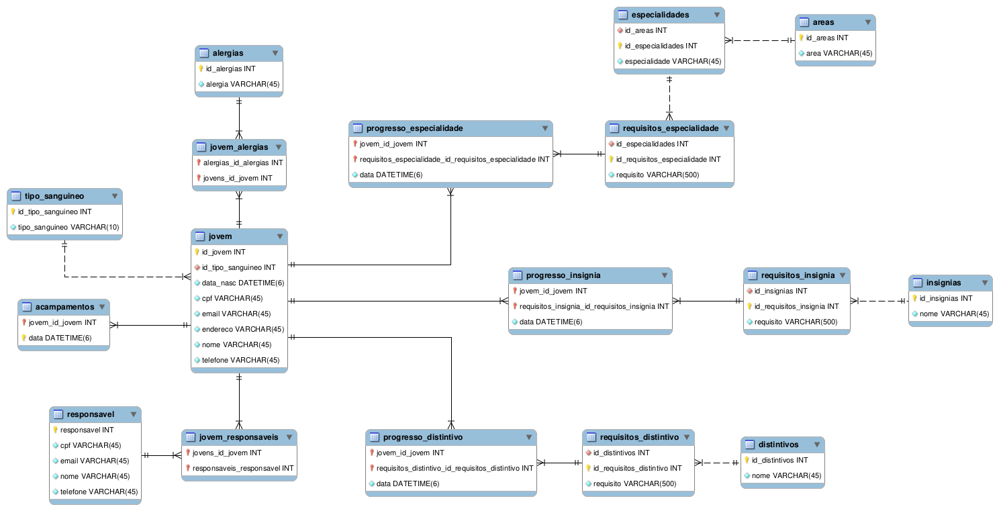

# Responsável

<a href="https://github.com/lucascraupp">
    <br />
    <sub><b>Lucas Coelho Raupp</b></sub></a><br />

&nbsp;

# Índice

1. [Sobre o uso do código](Readme.md#sobre-o-uso-do-código)
2. [Exemplos de uso](Readme.md#exemplos-de-uso)
3. [Tabelas Úteis](Readme.md#tabelas-úteis)
4. [Modelagem do Banco de Dados](Readme.md#modelagem-do-banco-de-dados)


# Sobre o uso do código

## Primeira vez

Para povoar o banco, basta iniciar o programa e rodar o arquivo [ProjetoBcdApplication.java](./Projeto_BCD/src/main/java/engtelecom/bcd/ProjetoBcdApplication.java).

## Demais Vezes

Para que o formato e estrutura do banco não sejam mais modificados, substitua a linha `8` do [application.properties](./Projeto_BCD/src/main/resources/application.properties#L8) para:

```sql
spring.jpa.hibernate.ddl-auto=none
```

Além disso, uma vez tendo criado todas as tabelas, comente a linha `1629` do [ProjetoRunner.java](./Projeto_BCD/src/main/java/engtelecom/bcd/ProjetoRunner.java#L1629), para que o método `geraTabelas()` não seja mais chamado.

# Exemplos de uso

## Registrando a progressão de um jovem

Para este exemplo, irei registrar um requisito da especialidade `Boxe` para o jovem `Ernest Will`.

No menu inicial, selecione a opção `1`:

```md
Escolha uma das opções abaixo:
**1 - Fazer um registro**
2 - Gerar um relatório
Escolha qualquer outra tecla para sair
```

Após isso, selecione a opção `2`:

```md
Escolha o que gostaria de registrar:
1 - Registrar um jovem.
**2 - Adicionar uma progressão de especialidade a um jovem**
3 - Adicionar uma progressão de insígnia a um jovem
4 - Adicionar uma progressão de distintivo a um jovem
5 - Adicionar um acampamento
Escolha qualquer tecla para retornar
```

Como queremos registrar um requisito da especilidade `Boxe`, vamos selecionar a opção `9`:

```md
Escolha uma das especialidades abaixo:
1 - Arqueologia
2 - Astronáutica
3 - Anatomia Humana
4 - Anime
5 - Budismo
6 - Arte em Origami
7 - Arco e Flecha
8 - Capoeira
**9 - Boxe**
10 - Almoxarifado
11 - Ferramentas de Corte
12 - Cidadania do Mundo
13 - Aquicultura
14 - Arte Digital
15 - Babá
```

Agora, uma lista contendo todos os requisitos existentes nessa especialidade será mostrada no terminal, sinta-se à vontade para selecionar um deles. Para o exemplo, selecionarei o requisito `74`:

```md
Escolha o requisito:
70 - Contar a história do boxe – nacional e mundial – para seu examinador.
71 - Descrever suas regras e demonstrar as 5 (cinco) técnicas básicas de golpes no boxe, citando cada golpe e demonstrando com 1 (um) professor e/ou outro praticante juvenil.
72 - Demonstrar 3 (três) tipos de saídas de golpes, 4 (quatro) tipos de defesa de golpes e duas defesas de mão.
73 - Listar, para seu examinador, nomes dos maiores nomes boxeadores da história, destacando suas principais características.
**74 - Apresentar todas as federações (brasileiras e internacionais) de boxe e como se organizam suas categorias.**
75 - Discorrer sobre os benefícios que o Boxe pode trazer para sua saúde e sua formação pessoal, apontando também os cuidados que se deve ter quanto à sua prática.
```

Por fim, informe o CPF do jovem que você deseja atribuir este requisito e a data que ele concluiu. No caso do `Ernest Will`, seu CPF é `865.411.217-45` e a data escolhida foi `03/02/2020`. Como ele ainda não havia conquistado o requisito, a progressão pôde ser cadastrada com sucesso!

```md
Informe o CPF do jovem: 865.411.217-45
Informe a data de conclusão do requisito: 03/02/2020
Progressão cadastrada com sucesso!
```

## Gerando um relatório dos jovens que possuem uma determinada especialidade

Aproveitando o exemplo anterior, onde registramos um requisito para o `Boxe`, vamos ver agora quais jovens já completaram esta especialidade.

No menu inicial, selecione a opção `2`:

```md
Escolha uma das opções abaixo:
1 - Fazer um registro
**2 - Gerar um relatório**
Escolha qualquer outra tecla para sair
```

Agora, escolha mais uma vez a opção `2`:
```md
Escolha qual relatório deseja:
1 - Dados biográficos de um determinado jovem
**2 - Jovens que possuem uma determinada especialidade**
3 - Especialidades e insígnias que um determinado jovem possui
4 - Requisitos já cumpridos por um determinado jovem para uma determinada especialidade
5 - Jovens que possuem todos os requisitos para obter o Cruzeiro do Sul
Escolha qualquer tecla para retornar
```

Novamente, iremos selecionar a opção `9`, correspondente ao `Boxe`:

```md
Escolha uma das especialidades abaixo:
1 - Arqueologia
2 - Astronáutica
3 - Anatomia Humana
4 - Anime
5 - Budismo
6 - Arte em Origami
7 - Arco e Flecha
8 - Capoeira
**9 - Boxe**
10 - Almoxarifado
11 - Ferramentas de Corte
12 - Cidadania do Mundo
13 - Aquicultura
14 - Arte Digital
15 - Babá
```

O resultado desta pesquisa pode ser conferido no terminal:

```md
Jovens que possuem os Requisitos: 
Cayla Upton
```

Mas se nós registramos um requisito do `Ernest Will` nessa especialidade, por que ele não está aparecendo nesta lista?
Bem, como pode ser conferido mais acima, o `Boxe` possui muitos requisitos a serem superados e como o jovem escolhido só conseguiu concluir um deles, ainda não está apto a receber esta conquista.

# Tabelas Úteis

## Jovem

| id_jovens | id_tipo_sanguineo |         data_nasc         |       cpf      |           email            |      endereco      |             nome            |       telefone        |
|:---------:|:-----------------:|:-------------------------:|:--------------:|:--------------------------:|:-------------------:|:---------------------------:|:----------------------:|
|     1     |         2           | 2011-08-14 00:00:00.000000 | 865.411.217-45 |  will.ernest@gmail.com     |  3117 Stokes Flats |        Ernest Will         | (727) 936-3855 x5780  |
|     2     |         1           | 2009-11-16 00:00:00.000000 | 683.083.207-16 |      onie@yahoo.com        | 238 Parisian Square|      Onie Gulgowski         | (641) 817-0445 x5535  |
|     3     |         5           | 2014-07-04 00:00:00.000000 | 401.571.884-42 | haag.francis@gmail.com     |58314 Anjelica Landing|        Francis Haag         |      (267) 872-4230     |
|     4     |         8           | 2011-08-15 00:00:00.000000 | 724.724.140-30 |    caylaup@outlook.com     |  5715 Murazik Forge|        Cayla Upton          | (865) 301-6946 x0909  |
|     5     |         6           | 2009-03-24 00:00:00.000000 | 258.668.417-62 |    marg.crui@gmail.com      | 25852 Corkery Bridge| Margherita Cruickshank      |      (574) 626-0169     |


## Responsável

| responsavel |       cpf        |           email           |          nome           |      telefone       |
|:-----------:|:----------------:|:-------------------------:|:-----------------------:|:---------------------:|
|      1      | 628.462.126-43   | rickey.little@gmail.com   |      Rickey Little      |    (48) 98149-1949   |
|      2      | 105.087.240-15   |   baubach@hotmail.com     |  Dan Baumbach III       |    (49) 97370-4847   |
|      3      | 681.467.611-78   |  teddyh@hotmail.com       |      Teddy Harris       |    (51) 99512-3438   |
|      4      | 407.440.046-40   |   shoppe@gmail.com        |     Shannon Hoppe       |   (48) 3235-8287    |
|      5      | 870.510.875-68   |   torphy@yahoo.com        |     Tyesha Torphy        |   (73) 99011-6840   |


## Tipo Sanguíneo

| id_tipo_sanguineo | tipo_sanguineo |
|:------------------:|:--------------:|
|         1          |       A+       |
|         2          |       A-       |
|         3          |       B+       |
|         4          |       B-       |
|         5          |       O+       |
|         6          |       O-       |
|         7          |      AB+       |
|         8          |      AB-       |


## Alergias

|  id_alergias |   alergia  |
|:------------:|:----------:|
|      1       |   Aranha   |
|      2       |  Amendoim  |
|      3       |   Glúten   |
|      4       |   Ácaro    |
|      5       |    Ovo     |


# Modelagem do Banco de Dados



